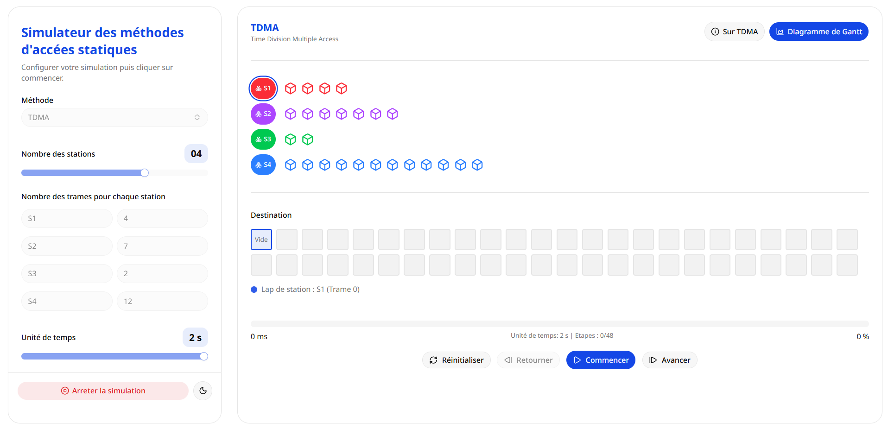
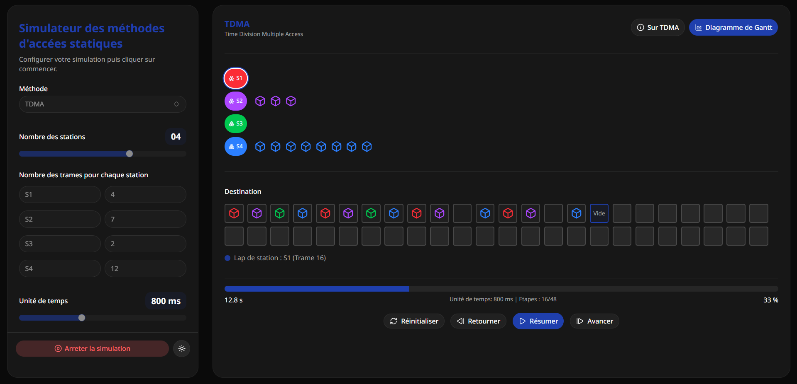

# Introduction
Ce travail est basé sur la création d'une application web pour simuler la méthode d'accès TDMA (Time Division Multiple Access).

# Outils utilisés
C'est une application web créée à l'aide des outils suivants :
- **Framework :** ReactJS  
- **Bibliothèque de composants :** ShadCN UI  
- **Frontend :** TailwindCSS  
- **Éditeur de code :** VS Code  
- **Navigateur :** Brave Browser  

# Explication de l'application

L'utilisateur doit d'abord configurer la simulation avant de commencer. Il doit :
- Choisir le nombre de stations à l'aide d'un *slider* (minimum : 1 station, maximum : 5 stations)
- Préciser le nombre de trames pour chaque station (1 par défaut, minimum : 0)
- Choisir l'unité de temps à l'aide d'un *slider* (par défaut : 20 millisecondes, minimum : 20 ms, maximum : 2 secondes)
- Une fois ces paramètres définis, la simulation est prête

Pour commencer la simulation, l'utilisateur clique sur le bouton **"Commencer la simulation"**, ce qui rend visible la zone de simulation.

Dans la partie supérieure, on trouve le nom de la méthode d'accès sélectionnée ainsi que deux boutons :
- **Sur TDMA :** affiche une boîte de dialogue expliquant le principe de la méthode TDMA  
- **Diagramme de Gantt :** permet de visualiser l’ordonnancement des transmissions sous forme d’un diagramme de Gantt  

## Zone de simulation

La zone principale de simulation est divisée en deux parties :

- **Partie supérieure (stations)** : représente les différentes stations (S1, S2, S3, S4, etc.).  
  Chaque station possède une couleur spécifique et contient des trames représentées sous forme de blocs.  
  Le nombre de blocs correspond au nombre de trames configuré.

- **Partie inférieure (Destination)** : représente le canal de transmission ou la destination finale.  
  Les trames envoyées par les stations y apparaissent progressivement selon l’ordre TDMA.

## Déroulement de la simulation

Une fois que l'utilisateur clique sur **Commencer**, la simulation se déroule étape par étape :

- À chaque unité de temps, une seule station peut transmettre
- Les stations transmettent selon un ordre cyclique (principe TDMA)
- Chaque transmission déplace une trame vers la zone **Destination**
- Un texte indique l’état courant (ex : *"Lap de station : S3 (Trame 38)"*)

## Contrôles de la simulation

L'utilisateur dispose des contrôles suivants :

- **Commencer** : lance la simulation automatiquement  
- **Avancer** : exécution pas à pas  
- **Retourner** : revenir à l’étape précédente  
- **Réinitialiser** : remettre à zéro  
- **Arrêter la simulation** : stopper l’exécution  

## Indicateurs de progression

En bas de l’interface :

- Temps écoulé (ms ou s)
- Nombre d’étapes réalisées / total
- Pourcentage d’avancement

## Résumé du fonctionnement

Cette application permet de simuler TDMA de manière visuelle et interactive. Elle met en évidence :

- Le partage du canal entre stations  
- L’allocation des slots temporels  
- L’absence de collision  

Ainsi, l'utilisateur comprend mieux le fonctionnement du TDMA grâce à une représentation dynamique.

## Interface de l'application

## Remarque importante

**Note :** L'application n'est pas entièrement optimisée pour les appareils mobiles.  
Des problèmes d'affichage et d'interaction peuvent apparaître sur smartphones et tablettes,  
notamment au niveau de la disposition des éléments.  

👉 Il est recommandé d'utiliser l'application sur ordinateur.

# Code source et lien d'utilisation

Le code source est disponible sur GitHub :
- **Code source :** https://lien-github-ici

L'application est accessible en ligne :
- **Accès à l'application :** https://lien-application-ici
